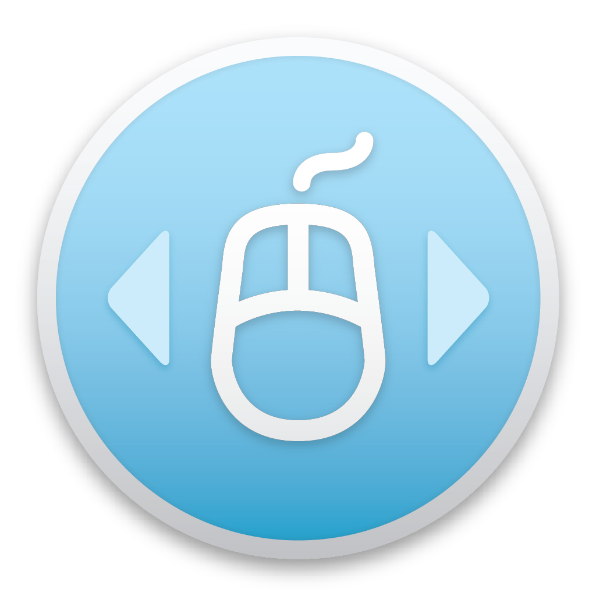

<p align="center">
  
</p>

<h1 align="center">SensibleSideButtons</h1>

<p align="center">
  
  
  
  
  
  
</p>

macOS mostly ignores the M4/M5 mouse buttons, commonly used for navigation. Third-party apps can bind them to ⌘+[ and ⌘+], but this only works in a small number of apps and feels janky. With this tool, your side buttons will simulate 3-finger swipes, allowing you to navigate almost any window with a history. As seen in the Logitech MX Master!

Extensive information on this tweak can be found here: https://sensible-side-buttons.archagon.net

## Supported macOS Versions

| Target | Minimum | Maximum Tested |
|--------|---------|----------------|
| Swift (recommended) | macOS 11.0 | macOS 26 |
| ObjC (legacy) | macOS 10.13 | macOS 26 |

Any macOS version below 26 is supported. The app will display a warning if launched on an untested future release.

## Features

- Translates mouse button 4/5 into system-wide 3-finger swipe gestures
- Menu bar icon with enable/disable, swap buttons, trigger-on-down options
- Global hotkey **⌘⇧B** to toggle menu bar icon visibility
- macOS version check — warns if running on an untested release (> macOS 15)
- Graceful failure handling — if gesture synthesis fails, the button press passes through instead of being swallowed
- Periodic Accessibility (TCC) permission monitoring — disables gracefully if permission is revoked
- Hardened runtime enabled
- Universal binary (arm64 + x86_64)

## Keyboard Shortcuts

| Shortcut | Action |
|----------|--------|
| ⌘⇧B | Toggle menu bar icon visibility (global — works even when icon is hidden) |
| ⌘E | Toggle enabled (when menu is open) |
| ⌘Q | Quit (when menu is open) |

## Building

Requires Xcode (full install, not just Command Line Tools).

```bash
./build.sh                  # Release, Swift target (default)
./build.sh Debug            # Debug, Swift target
./build.sh Release objc     # Release, ObjC legacy target
```

The built app is at `build/Release/SensibleSideButtons.app`.

### Targets

| Target | Language | Min macOS | Notes |
|--------|----------|-----------|-------|
| SensibleSideButtonsSwift | Swift + SwiftUI | 11.0 | Recommended, actively maintained |
| SensibleSideButtons | Objective-C | 10.13 | Legacy, original codebase |

### Building the Swift target manually

In Xcode, select the **SensibleSideButtonsSwift** scheme and build. The target includes:
- Sources: `SideButtonFixer/Swift/*.swift` + `External/TouchEvents.c`
- Bridging Header: `SideButtonFixer/Swift/BridgingHeader.h`
- Deployment Target: macOS 11.0+
- Hardened Runtime: enabled

## Installation

1. Build or download the app
2. Move `SensibleSideButtons.app` to `/Applications/`
3. Launch it — grant Accessibility permission when prompted
4. (Optional) Add to Login Items for auto-start:
   - System Settings → General → Login Items → add the app

> **Note:** The GitHub Releases build is not notarized. macOS Gatekeeper may show a warning ("app is damaged" or "unidentified developer"). To bypass, right-click the app → Open, or run `xattr -cr SensibleSideButtons.app` after unzipping.

## License

GPLv2 — see [LICENSE](LICENSE).
=======
macOS mostly ignores the M4/M5 mouse buttons, commonly used for navigation. Third-party apps can bind them to ⌘+[ and ⌘+], but this only works in a small number of apps and feels janky. With this tool, your side buttons will simulate 3-finger swipes, allowing you to navigate almost any window with a history. As seen in the Logitech MX Master!

Extensive information on this tweak can be found here: http://sensible-side-buttons.archagon.net

To ensure SensibleSideButtons opens whenever you start your computer:

1. Go to System Preferences
1. Click Users & Groups
1. Click your username in the left panel
1. Click Login Items at the top
1. Click the plus button at the bottom
1. Go to wherever you put the app (probably your Applications folder) and double-click it
